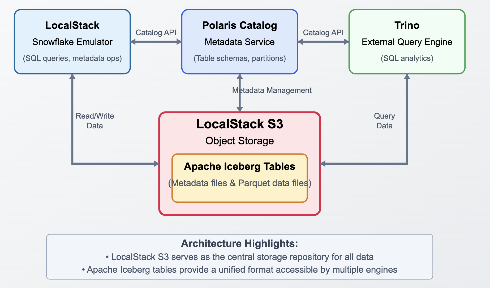

# Polaris Demo

This project demonstrates the integration of Apache Polaris with LocalStack for Snowflake and Trino for local development and testing.

## Architecture



## Components

- **Apache Polaris**: A metadata catalog service
- **LocalStack for Snowflake**: Local version of Snowflake 
- **Trino**: Distributed SQL query engine

## Prerequisites

- Docker and Docker Compose
- AWS CLI (for testing with LocalStack)

## LocalStack Authentication

LocalStack for Snowflake requires a valid `LOCALSTACK_AUTH_TOKEN` and set it as environment variable.  
You can obtain a token by signing up at [LocalStack](https://app.localstack.cloud/).

Export it in your shell before running Docker Compose:

```bash
export LOCALSTACK_AUTH_TOKEN=your-localstack-auth-token
```

If you are using the open-source version of LocalStack, this variable is not required.

## Getting Started

1. Start the services:
   ```bash
   docker-compose up -d
   ```

2. Wait for all services to be healthy (especially Polaris)


### AWS CLI Commands

**Note:**  
This demo requires a bucket named `test-bucket` to exist in LocalStack S3.  
You can create it with:

1. Create a test bucket:
   ```bash
   aws --endpoint-url=http://localhost:4566 s3 mb s3://test-bucket
   ```

2. List objects in the bucket:
   ```bash
   aws --endpoint-url=http://localhost:4566 s3api list-objects --bucket test-bucket
   ```

3. Alternative using awslocal (if installed):
   ```bash
   awslocal s3 mb s3://test-bucket
   awslocal s3api list-objects --bucket test-bucket
   ```

## Running the SQL Script

The file `script.sql` contains a full example workflow for setting up an external Iceberg volume, catalog integration, table creation, data insertion, and querying using Snowflake/Trino semantics with this stack.

To execute the script:

1. Ensure all services are running and the S3 bucket exists (see above).
2. Use your preferred SQL client or Snowflake CLI to connect to the appropriate service (e.g., Trino CLI or Snowflake client pointing to LocalStack/Snowflake emulator).
3. Run the commands in `script.sql` step by step, or copy-paste them into your SQL client.

**Example:**  
To run the entire script using SnowSQL, use:
```bash
snowsql -f script.sql
```
Adjust the command as needed for your SQL client and connection parameters.

**Trino CLI Example:**  
To query the Iceberg table using Trino (from the Trino container):
```bash
docker exec -it polaris-demo-trino-1 trino
```
Then, at the `trino>` prompt, run:
```sql
select * from iceberg.test_namespace.iceberg_table;
```
Expected output:
```
   c1
--------
 test
 foobar
(2 rows)
```
This demonstrates that the tables are interoperable between LocalStack Snowflake and Trino.

## Testing

1. The Polaris catalog will be automatically created with the test bucket configuration.

2. You can verify the setup by:
   - Checking Polaris API health: http://localhost:8181/healthcheck
   - Accessing Trino UI: http://localhost:8080
   - Listing S3 buckets in LocalStack

## Project Structure

```
.
├── docker-compose.yml
├── create-polaris-catalog.sh
├── trino-config/
│   └── catalog/
├── script.sql
└── README.md
```

## Troubleshooting

1. If services fail to start:
   - Check Docker logs: `docker-compose logs`
   - Verify environment variables are set correctly
   - Ensure ports are not in use

2. If Polaris catalog creation fails:
   - Check LocalStack is running: `curl http://localhost:4566/health`
   - Verify S3 bucket exists: `aws --endpoint-url=http://localhost:4566 s3 ls`
   - Check Polaris logs: `docker-compose logs polaris` 